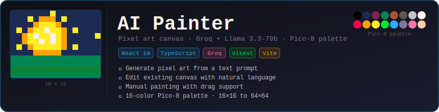

<div align="center">



<br/>

[](src)
[](src)
[](https://react.dev)
[](https://www.typescriptlang.org)
[](https://groq.com)
[](https://vitejs.dev)

</div>

---

## What is it?

**AI Painter** is a pixel art canvas where you describe what you want in plain text and the AI draws it — or you paint yourself. It uses **Groq + Llama 3.3-70b** to return pixel instructions as JSON, which are then rendered cell-by-cell on an HTML5 canvas using the classic **Pico-8 16-color palette**.

> Canvas empty → AI **generates from scratch**.  
> Canvas has pixels → AI **edits only what needs to change**.

---

## Features

| | |
|---|---|
| 🤖 **AI generation** | Describe any image in plain text — the AI fills the canvas |
| ✏️ **AI editing** | Paint a few pixels, then prompt the AI to refine or extend |
| 🖱️ **Manual painting** | Click or drag to paint; hold to paint multiple pixels |
| 🧹 **Erase tool** | Toggle erase mode to clear individual pixels |
| 🗑️ **Clear canvas** | Reset the whole canvas in one click |
| 🎨 **Pico-8 palette** | 16 handpicked colors — the iconic retro palette |
| 📐 **Grid sizes** | 16×16 · 32×32 · 64×64 |
| ⚡ **Loader** | Spinner overlay while the AI is processing |
| ✕ **Error dismiss** | Inline error banner with one-click dismiss |
| ⏎ **Enter to send** | Press Enter to send a prompt; Shift+Enter for newline |

---

## Architecture

```
src/
├── domain/                     # Pure functions — zero React, zero side effects
│   ├── canvas/
│   │   ├── CanvasGrid.ts       # Grid state + applyInstructions()
│   │   ├── DrawingEngine.ts    # renderToCanvas() — HTML5 canvas renderer
│   │   └── PixelInstruction.ts # {x, y, color} + GridSize types
│   ├── ai/
│   │   ├── instruct-painter.ts # Core: serialize grid → Groq → parse delta
│   │   ├── parse-instructions.ts # JSON parser with auto-repair
│   │   └── serialize-grid.ts   # CanvasGrid → ASCII snapshot for LLM context
│   └── palette/
│       └── pico8.ts            # 16 colors + letter codes
│
├── infrastructure/
│   └── groq/
│       └── groq-client.ts      # CompleteFn adapter (Groq SDK)
│
├── hooks/
│   └── use-painter.ts          # State machine: grid + loading + error + color
│
└── ui/
    ├── pages/PainterPage/      # Root layout
    ├── organisms/
    │   ├── PixelCanvas/        # Canvas + drag painting + loader overlay
    │   └── ChatPanel/          # Prompt input + error banner
    └── molecules/
        ├── ChatInput/          # Textarea with Enter-to-submit
        ├── CanvasToolbar/      # Color picker + erase + clear
        └── GridSizeSelector/   # 16/32/64 switcher
```

**Design principles**: Screaming Architecture · Hexagonal (ports & adapters) · Atomic Design · Container/Presentational · Strict TDD (80% coverage threshold on pre-commit)

---

## How the AI works

```
User types prompt
       │
       ▼
 isGridEmpty(grid)?
       │
  ┌────┴────┐
  │ YES     │ NO
  ▼         ▼
DRAW      EDIT
prompt    prompt
  │         │
  └────┬────┘
       │
       ▼
 serializeGrid() → ASCII snapshot
       │
       ▼
 Groq API (Llama 3.3-70b)
 maxTokens: 1024 (draw) / height×24 (edit)
       │
       ▼
 parseInstructions()
 + repairJson() (unquoted keys, single quotes, trailing commas)
       │
       ▼
 applyInstructions(grid, delta)
       │
       ▼
 Canvas re-renders ✓
```

The ASCII snapshot uses single-letter Pico-8 codes (`K`=black, `E`=red, `B`=blue…) to compress the canvas state for the LLM. An empty cell is `.`. A 16×16 canvas fits in ~260 tokens.

---

## Getting Started

### Prerequisites

- Node 22+
- A [Groq API key](https://console.groq.com) (free tier works)

### Setup

```bash
git clone https://github.com/unaivv/ai-painter.git
cd ai-painter
npm install
```

Create `.env.local`:

```env
VITE_GROQ_API_KEY=your_groq_api_key_here
```

### Run

```bash
npm run dev        # http://localhost:5173
npm run test:run   # run tests once
npm run test       # watch mode
```

---

## Pico-8 Palette

<div align="center">

| | Color | Hex | | Color | Hex | | Color | Hex | | Color | Hex |
|---|---|---|---|---|---|---|---|---|---|---|---|
| 🟫 | Black | `#000000` | 🟦 | Dark Blue | `#1d2b53` | 🟣 | Dark Purple | `#7e2553` | 🟩 | Dark Green | `#008751` |
| 🟤 | Brown | `#ab5236` | ⬛ | Dark Grey | `#5f574f` | ⬜ | Light Grey | `#c2c3c7` | 🔳 | White | `#fff1e8` |
| 🔴 | Red | `#ff004d` | 🟠 | Orange | `#ffa300` | 🟡 | Yellow | `#ffec27` | 💚 | Green | `#00e436` |
| 🔵 | Blue | `#29adff` | 🔷 | Indigo | `#83769c` | 🩷 | Pink | `#ff77a8` | 🍑 | Peach | `#ffccaa` |

</div>

---

## Stack

| Layer | Tech |
|---|---|
| UI | React 19 + TypeScript 6 + Vite 8 |
| AI | Groq SDK · Llama 3.3-70b-versatile |
| Canvas | HTML5 Canvas API (imperative, no libs) |
| Styling | CSS Modules + CSS custom properties |
| Testing | Vitest 4 · Testing Library · jsdom |
| Quality | GGA pre-commit hook · 80% coverage threshold |

---

## License

MIT
